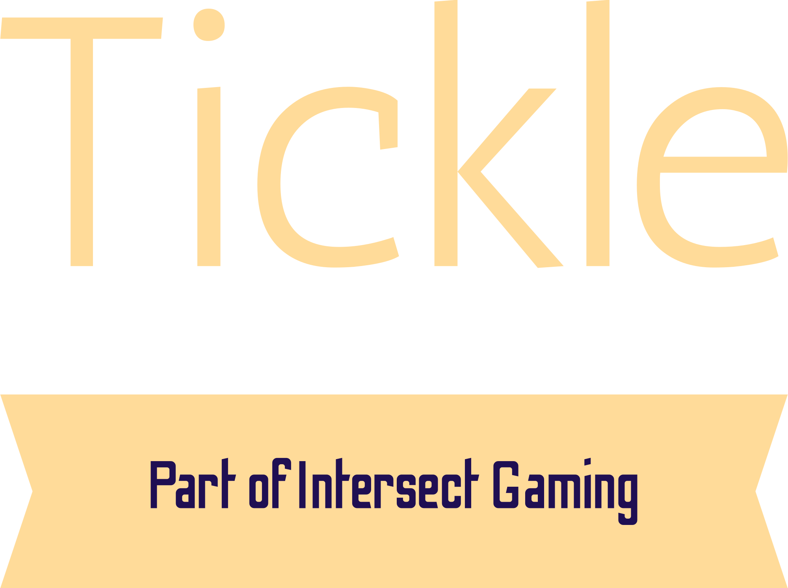

**A good-looking tic-tac-toe game built with React. It's the classic tic-tac-toe game that we play...but it has a slight twist....It is neon themed and vs AI.
I'm working towards building a strong AI and even add multiplayer and other features.**

# Documentation

# Dependencies (Software) :
**Node.js : 20.7.0 [Recommended]**

**NPM : 10.2.4 [Recommended]**

# Alert
Currently under development.

# Installation
Install the lastest release and run `npm start`.

# Notice
Images by [icon-icons.com](https://www.icon-icons.com) 
Song: SICKO MODE [By Travis Scott feat. Drake]

Tickle (Part of Intersect Gaming)
Copyright (C) 2023-present  Himank Deka

This program is free software: you can redistribute it and/or modify
it under the terms of the GNU Affero General Public License as published
by the Free Software Foundation, either version 3 of the License, or
(at your option) any later version.

This program is distributed in the hope that it will be useful,
but WITHOUT ANY WARRANTY; without even the implied warranty of
MERCHANTABILITY or FITNESS FOR A PARTICULAR PURPOSE.  See the
GNU Affero General Public License for more details.

You should have received a copy of the GNU Affero General Public License
along with this program.  If not, see <https://www.gnu.org/licenses/>.
